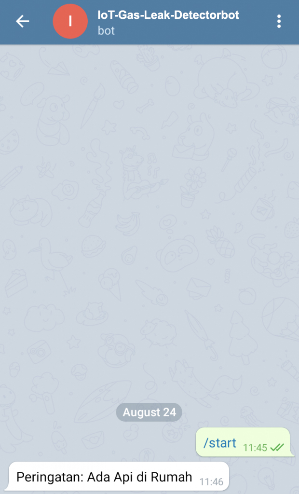

# IoT Gas Leak Detector Telegram

## Description:

- MQ-2 is a sensor used to detect the concentration of flammable gases in the air and smoke and the output reads as an analog voltage. The MQ-2 smoke gas sensor can be directly adjusted for sensitivity by rotating its trimpot. This sensor is commonly used to detect gas leaks both at home and in industry. Gases that can be detected include: LPG, isobutane, propane, methane, alcohol, hydrogen, smoke. If this MQ-2 sensor is connected to an IoT device, the information obtained can be processed and displayed anywhere.

## Circuit Schematic

- Below you can see a schematic image to facilitate the wiring of cables from the microcontroller to devices, both input and output sensors:


## Component (Tools & Materials):

- NodeMCU ESP8266 = 1 unit;
- MQ-2 Sensor = 1 unit;
- Piezo Buzzer = 1 unit;
- BreadBoard / ProjectBoard = 1 unit;
- Wired.

## Sketch Code Program:

```cpp
#include "CTBot.h"  //Pendeklarasian Library
CTBot myBot;

String ssid = "Veendy-Suseno";      //nama ssid wifi kalian
String pass = "Admin12345";         //password wifi kalian
String token = "XXXX";              //token bot baru kalian
const int id = XXXX;                //id telegram kalian

int buzzer = D2;
int smokeA0 = A0;
int sensorThres = 600;

void setup() {
    Serial.begin(9600);
    Serial.println("Starting TelegramBot...");
    myBot.wifiConnect(ssid, pass);
    myBot.setTelegramToken(token);
    if (myBot.testConnection()) {
        Serial.println("Koneksi Bagus");
    } else {
        Serial.println("Koneksi Jelek");
    }
    pinMode(buzzer, OUTPUT);
    pinMode(smokeA0, INPUT);
}

void loop() {
    int analogSensor = analogRead(smokeA0);
    Serial.print("Pin A0: ");
    Serial.println(analogSensor);
    if (analogSensor > sensorThres){
        tone(buzzer, 1000, 200);
        myBot.sendMessage(id, "Peringatan: Ada Api di Rumah");
    }
    else{
        noTone(buzzer);
    }
    delay(100);
}

```

## Interface:

<br/>
- Telegram Gas Leak Detector interface image. <br/>

## Conclusion:

- In this project, if there is a flammable gas in a room where there is an MQ-2 sensor, the sensor provides an output which will be read by the NodeMCU which will then make a buzzer sound and send a warning message to our Telegram.
